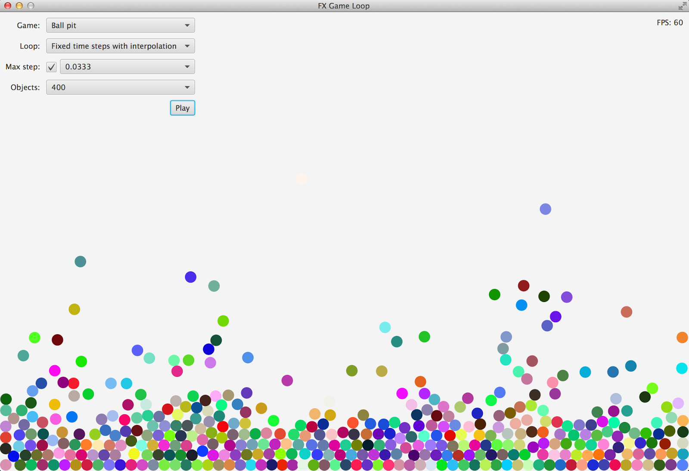

# Game loops in JavaFX

## Introduction

In an attempt to have some fun, I started reading up on game programming and game loops in particular. This is a summary of what I learned. I found this topic pretty fascinating and educational and hope you feel the same.

### The basic loop

If you've done any GUI programming at all, you'll know that GUI frameworks are event-driven. This means that the framework doesn't do very much, it simply waits for an event to occur, processes it, then waits for the next one. Games on the other hand tend to use a loop as a heartbeat that moves time forward. The simplest possible game loop looks something like:

```java
while (!gameOver)
{
    processEvents();
    updateWorld();
    renderFrame();
}
```

As you can probably tell, this loops handles any input that needs handling, moves the state of the game world one step forward in time, then renders this new state on screen.

This implementation of the game loop isn't very useful. It simply runs the loop as fast as possible. The result of this is that the faster your machine is, the faster time will move forward in the game. You could end up with a game character walking in slow motion on one machine, while running at the speed of light on another. This approach to a game loop is often called a CPU dependent game loop, for obvious reasons. It could work in situations where the speed of the machine is fixed and known, but that's usually not the case.

In what follows we'll explore several possibilities to improve upon this basic approach. Note that while the code examples will be in Java, they are intended only as illustrations and do not cover every single detail or edge case, so they should be viewed as pseudo-code only.

### Variable time steps

Think about this for a while: instead of using a fixed time step (as we did in the basic approach), why not simply measure how much time has passed since the previous iteration of the loop, and use that time difference to update the game world? By synchronising the game time with the real time, the game time will progress at a constant speed, no matter the speed of the machine.

#### Variable time steps - variable frame rate

A first implementation of this idea could look like:

```java
long previousTime = System.nanoTime();

while (!gameOver)
{
    long currentTime = System.nanoTime();
    long elapsedNanos = currentTime - previousTime;
    double deltaTime = elapsedNanos / 1_000_000_000.0; /* to seconds */

    processEvents();
    updateWorld(deltaTime);
    renderFrame();

    previousTime = currentTime;
}
```

In this approach the game world is no longer updated with fixed time steps, but with time steps that depend on the actual time that has passed since the previous iteration of the loop. If one machine is able to run this loop 100 times per second, that machine will update the world 100 times with time steps averaging 10ms. If another machine is only able to run the loop 50 times per second, that machine will update the world 50 times per second with time steps averaging 20ms. The result is the same on both machines: after 1 second of real time, the game time has advanced by 1 second as well.

This approach may seem great at first: not only does the game progress at a constant speed independent of the underlying hardware, the loop actually adjusts the frame rate to the underlying hardware as well as to the current load. The loop runs as fast as possible, but when the load increases (for example: if there are lots of objects that need to be updated), the time steps will increase as well, lowering the frame rate. If the load decreases, the time steps will decrease as well, raising the frame rate.

Variable frame rates are not without their issues however, especially when physics are involved:

- Low frame rates result in large time steps. Large time steps can cause objects to 'jump' between points, instead of moving smoothly between them. This in turn could result in collisions going undetected, allowing your game objects to pass through one another.
- High frame rates result in small time steps. As you probably know, floating point numbers only have limited precision, so floating point calculations often involve some sort of rounding error. If the time steps get too small, an unnecessary amount of calculations is performed. This could result in rounding errors accumulating to a point where your game objects end up in the wrong place.

Instead of throwing variable frame rates out the window, let's see if we can address some of these issues.

#### Variable time steps - variable frame rate with a target frame rate

The first issue we'll address is small time steps as a result of high frame rates. The solution for this is quite simple: impose an upper bound on the frame rate by making the loop wait until a minimum amount of time has passed. This approach looks something like:

```java
final double targetDelta = 0.0166; /* 16.6ms ~ 60fps */
long previousTime = System.nanoTime();

while (!gameOver)
{
    long currentTime = System.nanoTime();
    double deltaTime = (currentTime - previousTime) / 1_000_000_000.0; 

    processEvents();
    updateWorld(deltaTime);
    renderFrame();

    previousTime = currentTime;

    double frameTime = (System.nanoTime() - currentTime) / 1_000_000_000.0;
    if (frameTime < targetDelta) {
        /* wait targetDelta - frameTime seconds */
    }
}
```

As you can see, we measure the time it took to update the world and if necessary, make the loop wait a while before starting the next iteration. The resulting loop is said to have a target frame rate of 60fps. Because every iteration takes at least 16.6ms, the time steps will never be smaller than 16.6ms.

#### Variable time steps - variable frame rate with a target frame rate and a maximum time step

The technique we used to address small time steps unfortunately cannot be applied to large time steps as well: while we can tell the loop to wait a while, we can't tell it to 'hurry up' because our frame rate is getting too low. If the hardware can't keep up with our demand, the performance will degrade. There isn't much to be done about that. But we do have a choice as to how the game degrades:

- We stick to the previous implementation and let the frame rate drop. As a result, the game time keeps progressing at a constant speed but the time steps will grow larger, possibly making the game unplayable due to increased latency and physics issues.

- We impose an upper bound on the time steps. As a result, we are effectively slowing down time in the game because the time steps used to update the game will be smaller than the actual time that has passed. Whether or not this makes the game any more playable at low frame rates than with the previous approach is hard to say.

If you prefer the second option, your implementation could look like:

```java
final double targetDelta = 0.0166;
final double maxDelta = 0.05;
long previousTime = System.nanoTime();

while (!gameOver)
{
    long currentTime = System.nanoTime();
    double deltaTime = (currentTime - previousTime) / 1_000_000_000.0; 
    
    if (deltaTime > maxDelta) {
        deltaTime = maxDelta;
    }

    processEvents();
    updateWorld(deltaTime);
    renderFrame();

    previousTime = currentTime;

    double frameTime = (System.nanoTime() - currentTime) / 1_000_000_000.0;
    if (frameTime < targetDelta) {
        /* wait targetDelta - frameTime seconds */
    }
}
```

### Fixed time steps

It turns out our basic loop did have one advantage: fixed time steps. While the variable time step approach in the previous section might work fine for you, there are a few reasons why you should consider opting for a truly fixed time step.

Fixed time steps are the only way to get truly deterministic (and thus reproducible) behavior. As we discussed before, floating point calculations are not without errors. The result of a 16.4ms time step followed by a 16.8ms time step might not be the same as the result of two 16.6ms time steps. Fixed time steps and the resulting determinism makes it possible to:

- track down bugs by reproducing the exact circumstances in which the bug occurred.
- synchronise network play.
- provide instant replays.

#### Fixed time steps using an accumulator

Let's take a stab at re-implementing our game loop using fixed time steps:

```java
final double timeStep = 0.0166;
long previousTime = System.nanoTime();
double accumulatedTime = 0;

while (!gameOver)
{
    long currentTime = System.nanoTime();
    double deltaTime = (currentTime - previousTime) / 1_000_000_000.0;
    accumulatedTime += deltaTime;

    processEvents();

    while (accumulatedTime >= timeStep) {
        updateWorld(timeStep);
        accumulatedTime -= timeStep;
    }

    renderFrame();

    previousTime = currentTime;
}
```

The technique here is to slice the amount of time passed into `timeStep`-sized pieces. If we measured a delta time of 34ms and our time step is 16ms, we simply step the world twice. The remaining 2ms are saved in the accumulator and carried over to the next iteration. By doing this, the game time will progress at a relatively constant speed, yet we have all the benefits of a fixed time step.

There are two issues with this approach however. The first issue is that the number of steps taken in each iteration of the loop can vary. Let's say our time step is set at 16ms, yet most frames take 17-18ms. This 1-2ms difference will slowly build up in the accumulator until it reaches 16ms. At that point the game will move forward 32ms instead of the usual 16ms. This leads to what is knows as temporal aliasing.

The second issue is the so called 'spiral of death' where if one interation takes up a lot of time, the next iteration will have to take additional time steps, causing that iteration to take up even more time, etc. This issue didn't exist with variable time steps because we were updating the world only once, albeit with a large time step.

#### Fixed time steps using an accumulator and a maximum delta time

Let's start by addressing the spiral of death:

```java
final double timeStep = 0.0166;
final double maxDelta = 0.05;
long previousTime = System.nanoTime();
double accumulatedTime = 0;

while (!gameOver)
{
    long currentTime = System.nanoTime();
    double deltaTime = (currentTime - previousTime) / 1_000_000_000.0;

    if (deltaTime > maxDelta) {
        deltaTime = maxDelta;
    }

    accumulatedTime += deltaTime;

    processEvents();

    while (accumulatedTime >= timeStep) {
        updateWorld(timeStep);
        accumulatedTime -= timeStep;
    }

    renderFrame();

    previousTime = currentTime;
}
```

As you can see, this is exactly the same as what we did with the variable time steps. The result is the same as well: by limiting delta time to `maxDelta`, the game time will effectively slow down once delta time gets larger than `maxDelta`.

#### Fixed time steps using an accumulator, a maximum delta time and interpolation

Now, how do we take care of temporal aliasing? Temporal anti-aliasing of course, which in this case boils down to a seemingly simple interpolation:

```java
final double timeStep = 0.0166;
final double maxDelta = 0.05;
long previousTime = System.nanoTime();
double accumulatedTime = 0;

while (!gameOver)
{
    long currentTime = System.nanoTime();
    double deltaTime = (currentTime - previousTime) / 1_000_000_000.0;

    if (deltaTime > maxDelta) {
        deltaTime = maxDelta;
    }

    accumulatedTime += deltaTime;

    processEvents();

    while (accumulatedTime >= timeStep) {
        updateWorld(timeStep);
        accumulatedTime -= timeStep;
    }

    interpolateWithAlpha(accumulatedTime / timeStep);

    renderFrame();

    previousTime = currentTime;
}
```

What the interpolation does is simply guess where all the game objects would have been, had we taken the remaining accumulated time into account. This can be expressed as follows:

```java
interpolatedState = currentState + alpha * (nextState - currentState)
```

which is equal to:

```java
interpolatedState = (1 - alpha) * currentState + alpha * nextState
```

For example: if the remaining accumulated time is 25% of a complete time step, this interpolation guesses where the game objects would have been, had we taken an additional 25% of a time step.

While this all looks simple in pseudo-code, implementing interpolation is not as easy as the pseudo-code makes it look. In order to calculate the interpolated state, you need to maintain two separate copies of the game state: the current state as well as the next state.

Also note that because the physics system always needs to calculate one step ahead (we need the next state to do the interpolation), this technique adds additional input latency to your game.

### Results

So which implementation should you use? My short answer would be: if you're using a physics engine, you need fixed time steps, period. If not, variable time steps might be easier to implement and work just fine.

### References

I learned the most from the following sources, so go and check them out:

- <a href="http://gafferongames.com/game-physics/fix-your-timestep/">Fix Your Timestep</a> by Glenn Fiedler.
- <a href="http://www.koonsolo.com/news/dewitters-gameloop/">deWiTTERS Game Loop</a> by Koen Witters.
- <a href="http://www.gameenginebook.com">Game Engine Architecture</a> by Jason Gregory.
- <a href="http://www.pearsonhighered.com/bookseller/product/Game-Programming-Algorithms-and-Techniques-A-PlatformAgnostic-Approach/9780321940155.page">Game Programming Algorithms and Techniques</a> by Sanjay Madhav.

## JavaFX

Next, I tried to apply this game loop theory to JavaFX, resulting in the demo application in this repository.



You can use this application to visually compare the different loops. This application uses Box2D (JBox2D) as a physics engine. Reading the "Hello Box2D" section in the <a href="http://box2d.org/manual.pdf">Box2D manual</a> should be sufficient to understand the code. The application is extensible so you can easily add new games, animations or game loop implementations and try them out.

### Understanding JavaFX

Before we can talk about game loops, we need to discuss pulses. A pulse is a special event scheduled by JavaFX whenever animations are running or the scene otherwise needs updating. During a pulse:

- animations are advanced.
- CSS is applied.
- layout is done.
- the scene is synchronized with the render thread.

Pulses run at most 60 times per second, less if they take longer than 1/60th of a second. This means JavaFX already has target frame rate of 60FPS built-in. Less work for our game loop!

The easiest way to hook into the pulse system is to start an `AnimationTimer`. Objects of this class have a `handle` method. This method is called during every pulse and is passed the current time in nanoseconds. We'll use this `handle` method to implement our game loop.

To learn more about pulses, go watch the following talks on Parleys:

- <a href="http://parleys.com/play/514892290364bc17fc56c351">JavaFX Architecture and Programming Model</a> (Richard Bair, JavaOne 2011)
- <a href="http://parleys.com/play/52545133e4b0c4f11ec576ee">Optimizing JavaFX Applications</a> (Oleg Mazurov, JavaOne 2013)

### Variable time steps

The first implementation I'll discuss is that of a game loop using variable time steps. This is an implementation of "Variable time steps - variable frame rate with a target frame rate and a maximum time step" from earlier.

First note that I moved the implementation into a separate class `VariableSteps` and used callbacks to tell the loop what to do at certain points:

```java
private final Consumer<Float> updater;
private final Runnable renderer;
private final Consumer<Integer> fpsReporter;

public VariableSteps(Consumer<Float> updater,
                     Runnable renderer,
                     Consumer<Integer> fpsReporter)
{
    this.updater = updater;
    this.renderer = renderer;
    this.fpsReporter = fpsReporter;
}
```

First the `updater` will be called to update the physics state based on the amount of time passed. Next, the `renderer` will be called to update the properties of the nodes on screen based on their updated physics state. Finally, the `fpsReporter` will be called twice per second to update the FPS status on screen.

Class `VariableSteps` inherits from class `GameLoop`, which holds a `maximumStep` property common to all game loops in the demo application. Class `GameLoop` inherits from `AnimationTimer` so all our game loops are `AnimationTimer` subclasses and will override the `handle` method. For the variable time steps implementation, this is done as follows:

```java
private long previousTime = 0;
private float secondsElapsedSinceLastFpsUpdate = 0f;
private int framesSinceLastFpsUpdate = 0;

@Override
public void handle(long currentTime)
{
    if (previousTime == 0) {
        previousTime = currentTime;
        return;
    }

    float secondsElapsed = (currentTime - previousTime) / 1e9f;
    float secondsElapsedCapped = Math.min(secondsElapsed, getMaximumStep());
    previousTime = currentTime;

    updater.accept(secondsElapsedCapped);
    renderer.run();

    secondsElapsedSinceLastFpsUpdate += secondsElapsed;
    framesSinceLastFpsUpdate++;
    if (secondsElapsedSinceLastFpsUpdate >= 0.5f) {
        int fps = Math.round(framesSinceLastFpsUpdate / secondsElapsedSinceLastFpsUpdate);
        fpsReporter.accept(fps);
        secondsElapsedSinceLastFpsUpdate = 0;
        framesSinceLastFpsUpdate = 0;
    }
}
```

This implementation can be split up into four parts:

1. If this is the first frame, simply record the current time.
2. Calculate the amount of time passed since the previous frame (also converting nanoseconds to seconds) and adjust this to the maximum time step.
3. Call the `updater` and `renderer` callbacks.
4. Calculate FPS and report it to the `fpsReporter` callback.

I also override the `stop` method from AnimationTimer so the loops can be restarted:

```java
@Override
public void stop()
{
    previousTime = 0;
    secondsElapsedSinceLastFpsUpdate = 0f;
    framesSinceLastFpsUpdate = 0;
    super.stop();
}
```

Note that some of the choices I made here were intended to keep the code clean and readable, and to suit the demo application. For example:

- If you don't implement your game loop as a separate class, or implement it as an inner class, you might not need callbacks.
- If you don't need to be able to restart the game loop, you don't need to override the `stop` method.
- If you don't need to track FPS, you can of course delete that part of the code.

### Fixed time steps

Next up are fixed time steps. This is an implementation of "Fixed time steps using an accumulator and a maximum delta time" from earlier.

Class `FixedSteps` has two additional attributes compared to class `VariableSteps`:

```java
private static final float timeStep = 0.0166f;
private float accumulatedTime = 0;
```

These attributes are used in both the `handle` and `stop` methods:

```java
@Override
public void handle(long currentTime)
{
    if (previousTime == 0) {
        previousTime = currentTime;
        return;
    }

    float secondsElapsed = (currentTime - previousTime) / 1e9f;
    float secondsElapsedCapped = Math.min(secondsElapsed, getMaximumStep());
    accumulatedTime += secondsElapsedCapped;
    previousTime = currentTime;

    while (accumulatedTime >= timeStep) {
        updater.accept(timeStep);
        accumulatedTime -= timeStep;
    }
    renderer.run();

    secondsElapsedSinceLastFpsUpdate += secondsElapsed;
    framesSinceLastFpsUpdate++;
    if (secondsElapsedSinceLastFpsUpdate >= 0.5f) {
        int fps = Math.round(framesSinceLastFpsUpdate / secondsElapsedSinceLastFpsUpdate);
        fpsReporter.accept(fps);
        secondsElapsedSinceLastFpsUpdate = 0;
        framesSinceLastFpsUpdate = 0;
    }
}

@Override
public void stop()
{
    previousTime = 0;
    accumulatedTime = 0;
    secondsElapsedSinceLastFpsUpdate = 0f;
    framesSinceLastFpsUpdate = 0;
    super.stop();
}
```

As you can see, this is a pretty straightforward implementation of the pseudo-code. Things start to get interesting when we add interpolation, which is what I'll discuss next.

### Fixed time steps with interpolation

This is an implementation of "Fixed time steps using an accumulator, a maximum delta time and interpolation" from earlier.

At first sight, implementing interpolation seemed like quite a challenge. In order to interpolate, we need to maintain two separate states to interpolate between, namely the current state and the next state. This seemed like a lot of work, until I made the following observation: combining JavaFX with a physics engine automatically results in two separate states. On the one hand there is the state of the JavaFX nodes (`translateX`, `translateY`, ..) while on the other, there's the state of the physics bodies. Having realized that, I tried to come up with a clever implementation of interpolation that would not require any additional state on top of what we already have.

First we introduce an additional callback to handle interpolation:

```java
private final Consumer<Float> updater;
private final Runnable renderer;
private final Consumer<Float> interpolater;
private final Consumer<Integer> fpsReporter;

public FixedStepsWithInterpolation(Consumer<Float> updater,
                                   Runnable renderer,
                                   Consumer<Float> interpolater,
                                   Consumer<Integer> fpsReporter)
{
    this.updater = updater;
    this.renderer = renderer;
    this.interpolater = interpolater;
    this.fpsReporter = fpsReporter;
}
```

This `interpolater` will be called with the current alpha value to interpolate between the current state and the next state as discussed earlier. Next, the implementation I came up with goes as follows:

```java
@Override
public void handle(long currentTime)
{
    if (previousTime == 0) {
        previousTime = currentTime;
        return;
    }

    float secondsElapsed = (currentTime - previousTime) / 1e9f;
    float secondsElapsedCapped = Math.min(secondsElapsed, getMaximumStep());
    accumulatedTime += secondsElapsedCapped;
    previousTime = currentTime;

    if (accumulatedTime < timeStep) {
        float remainderOfTimeStepSincePreviousInterpolation = 
            timeStep - (accumulatedTime - secondsElapsed);
        float alphaInRemainderOfTimeStep =
            secondsElapsed / remainderOfTimeStepSincePreviousInterpolation;
        interpolater.accept(alphaInRemainderOfTimeStep);
        return;
    }

    while (accumulatedTime >= 2 * timeStep) {
        updater.accept(timeStep);
        accumulatedTime -= timeStep;
    }
    renderer.run();
    updater.accept(timeStep);
    accumulatedTime -= timeStep;
    float alpha = accumulatedTime / timeStep;
    interpolater.accept(alpha);

    secondsElapsedSinceLastFpsUpdate += secondsElapsed;
    framesSinceLastFpsUpdate++;
    if (secondsElapsedSinceLastFpsUpdate >= 0.5f) {
        int fps = Math.round(framesSinceLastFpsUpdate / secondsElapsedSinceLastFpsUpdate);
        fpsReporter.accept(fps);
        secondsElapsedSinceLastFpsUpdate = 0;
        framesSinceLastFpsUpdate = 0;
    }
}
```

It's easier to understand this code if you skip the special case where the accumulator is less than the time step and start reading at the while loop. The algorithm then goes as follows:

1. Keep calling the `updater` as long as there are two or more time steps remaining in the accumulator. After this is done, there is one complete time step left in the accumulator, and possibly a remainder as well.
2. Call the `renderer`. This updates the state of the nodes based on the current physics state, which will soon be the previous physics state, because there is still one time step left in the accumulator. For an example of 'rendering', see the method `updatePosition` below.
3. Do the final time step. At this point, the physics state is one step ahead of the state on screen. Calculate the alpha value based on the time remaining in the accumulator.
4. Call the `interpolater` with this alpha value. This will interpolate all game objects between their current state (the state of the node, based on the previous physics state) and their next state (the current physics state, as a result of the final time step). For an example of interpolation, see the method `interpolatePosition` below.

Rendering and interpolation examples taken from the class `Ball`:

```java
public void updatePosition()
{
    if (!body.isAwake()) {
        return;
    }
    setTranslateX(body.getPosition().x * SCALE);
    setTranslateY((HEIGHT - body.getPosition().y) * SCALE);
}

public void interpolatePosition(float alpha)
{
    if (!body.isAwake()) {
        return;
    }
    setTranslateX(alpha * body.getPosition().x * SCALE +
                  (1 - alpha) * getTranslateX());
    setTranslateY(alpha * (HEIGHT - body.getPosition().y) * SCALE +
                  (1- alpha) * getTranslateY());
}
```

These methods transform the world coordinates (the `x` and `y` positions of the physics body) into screen coordinates (based on the `SCALE` and `HEIGHT` settings of the game) and update the `translateX` and `translateY` properties of the node used to represent a ball on screen.

Finally, there's a special case where the accumulator is less than the time step. In this case we need to re-interpolate between the same two states we used for the previous interpolation. But this is impossible, as one of those states (the state of the node, based on the previous physics state) got overwritten during the previous interpolation. By summoning the vast power of mathematics however, we can adjust the alpha value to interpolate not between the previous physics state (which we don't have anymore) and the current physics state, but between the previous interpolation (which is now the state of the node) and the current physics state. Doing it this way avoids having to store multiple physics states.

### Results

I was very happy to see the expected behaviour reproduced in the demo application:

- Physics issues quickly appear when using variable time steps.
- A lot less physics issues appear when using fixed time steps. The issues that remain seem to be normal and a matter of accuracy vs. speed when configuring the physics engine.
- The spiral of death is easily reproduced by simulating a large number of objects without using a maximum step.
- Using a maximum time step causes the game to slow down instead of spiraling to death whenever the machine can't keep up.
- Interpolation does seem to smoothen out the animation. Try setting the demo application to fixed steps without interpolation, choose a low number of objects so the animation can run at full speed and turn off the maximum step. Look for glitches when a ball is stepped twice in one frame, instead of the usual one step per frame. Then turn on interpolation and see if these glitches disappear.

As a final note, I would like to point out that JavaFX is not at all aimed at game development. I would not recommend it for any serious game development. The reason I chose to implement this example using JavaFX is because it's a framework I enjoy using and use a lot in education.

**Note**: This repository contains a Maven project. It was last tested using NetBeans 8.0.2 and JDK 8u25.
